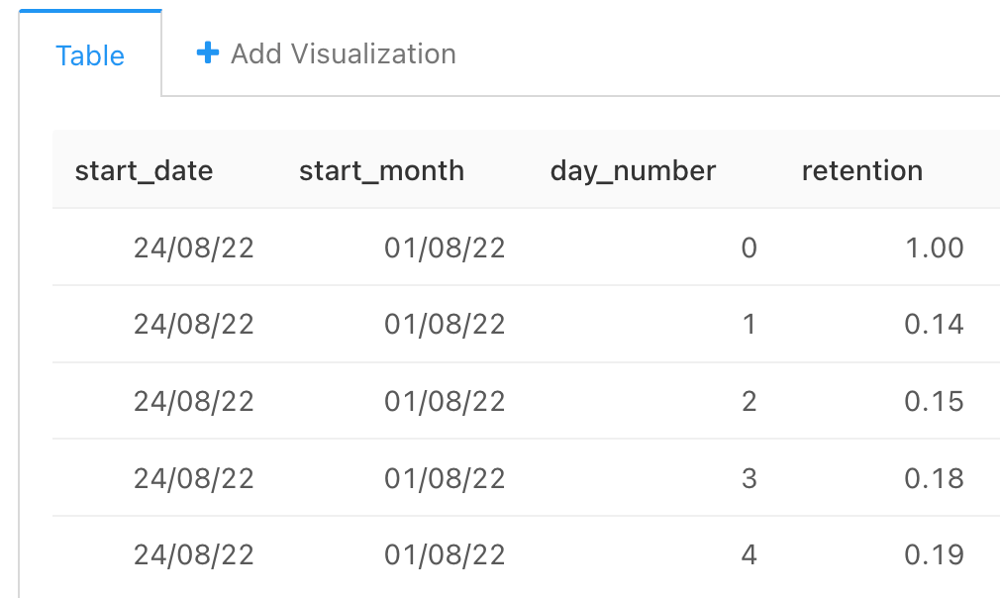
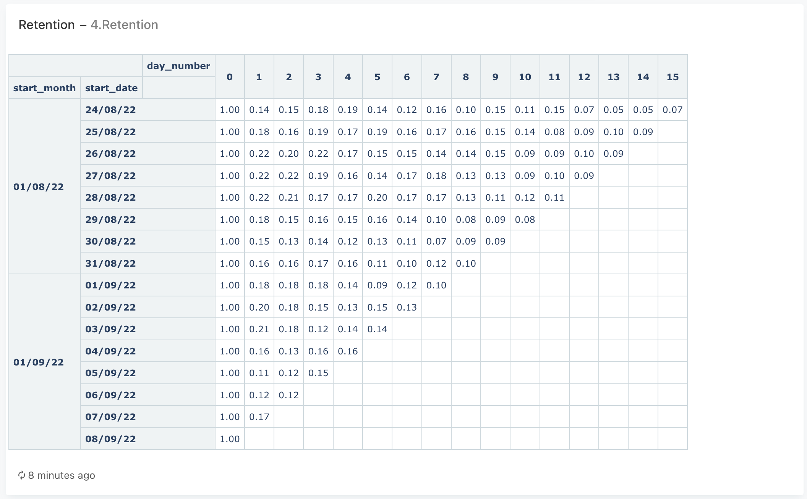

### Задача 4

На основе данных в таблице user_actions рассчитайте показатель дневного Retention для всех пользователей, разбив их на когорты по дате первого взаимодействия с нашим приложением.

В результат включите четыре колонки: месяц первого взаимодействия, дату первого взаимодействия, количество дней, прошедших с даты первого взаимодействия (порядковый номер дня начиная с 0), и само значение Retention.

Колонки со значениями назовите соответственно start_month, start_date, day_number, retention.

Месяц первого взаимодействия укажите в виде даты, округлённой до первого числа месяца.

Поля в результирующей таблице: ```start_month, start_date, day_number, retention```


#### Запрос
```sql
SELECT  start_date,
        DATE_TRUNC('month', start_date)::date as start_month,
        action_date - start_date as day_number,
        ROUND(COUNT(DISTINCT user_id)*1.0/ MAX(COUNT(DISTINCT user_id)) OVER (PARTITION BY start_date), 2) as retention

FROM (
    SELECT  user_id,
            time::date as action_date,
            MIN(time::date) OVER (PARTITION BY user_id) as start_date
    FROM user_actions  ) as t1   
GROUP BY start_date, action_date
ORDER BY start_date, day_number
```


Вариант верного (считам count отдельно)
```sql
SELECT date_trunc('month', start_date)::date as start_month,
       start_date,
       date - start_date as day_number,
       round(users::decimal / max(users) OVER (PARTITION BY start_date), 2) as retention
FROM   (SELECT start_date,
               time::date as date,
               count(distinct user_id) as users
        FROM   (SELECT user_id,
                       time::date,
                       min(time::date) OVER (PARTITION BY user_id) as start_date
                FROM   user_actions) t1
        GROUP BY start_date, time::date) t2
 ```

#### Таблица


#### График

