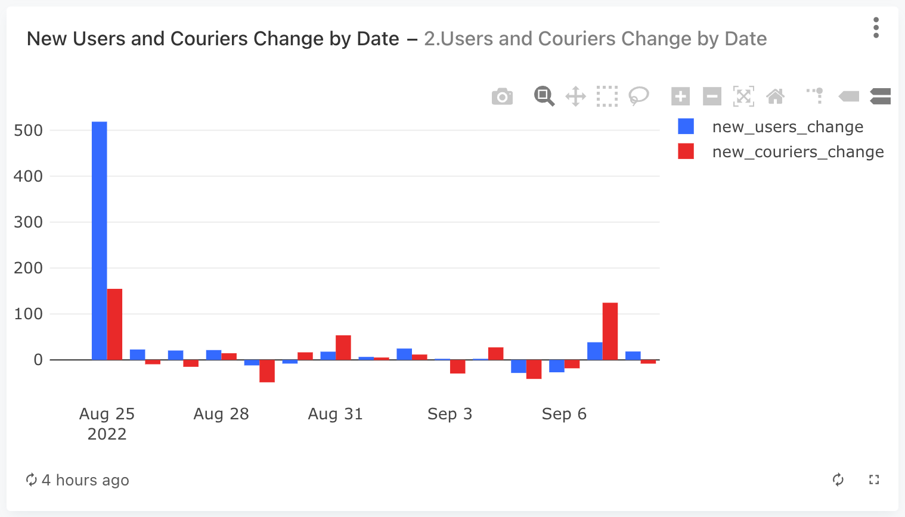
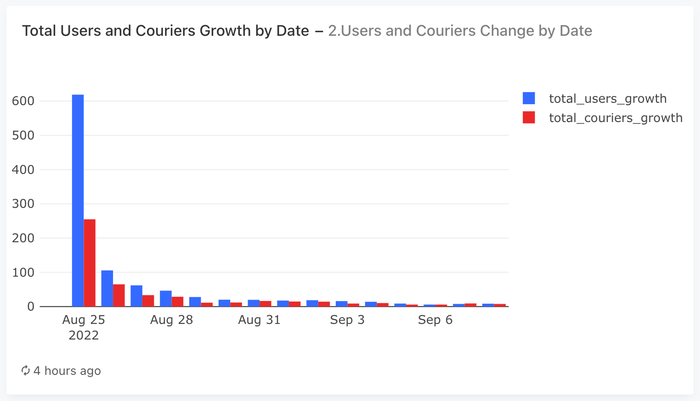
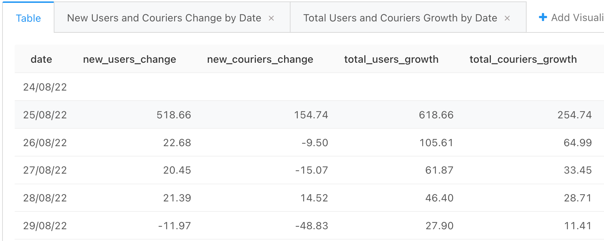

### Задача 2

Дополните запрос из предыдущего задания и теперь для каждого дня, представленного в таблицах user_actions и courier_actions, дополнительно рассчитайте следующие показатели:

- Прирост числа новых пользователей.
- Прирост числа новых курьеров.
- Прирост общего числа пользователей.
- Прирост общего числа курьеров.
- Показатели, рассчитанные на предыдущем шаге, также включите в результирующую таблицу.

Колонки с новыми показателями назовите соответственно ```new_users_change, new_couriers_change, total_users_growth, total_couriers_growth```. Колонку с датами назовите ``date``.

Все показатели прироста считайте в процентах относительно значений в предыдущий день. 

#### Запрос
```sql
WITH users_first_actions AS (
        SELECT  user_id,
                MIN(time)::date AS first_date
        FROM user_actions
        GROUP BY user_id
    ),
    
    couriers_first_actions AS (
        SELECT  courier_id,
                MIN(time)::date AS first_date
        FROM courier_actions
        GROUP BY courier_id
    ),
    
    users_and_couriers_first_actions AS (
        SELECT * 
        FROM users_first_actions
        JOIN couriers_first_actions
        USING(first_date)
    ),
    
    counts_by_date AS (
        SELECT  first_date as date,
                COUNT(DISTINCT user_id) as new_users,
                COUNT(DISTINCT courier_id) as new_couriers
        FROM users_and_couriers_first_actions
        GROUP BY first_date
        ORDER BY date
    ),
    
    metrics AS (
        SELECT  date,
            new_users,
            new_couriers,
            SUM(new_users) OVER (ORDER BY date)::int AS total_users,
            SUM(new_couriers) OVER (ORDER BY date)::int AS total_couriers
        FROM counts_by_date
    )
    
SELECT  date,
        --  прирост новых пользователей к предыдущему дню
        ROUND((new_users - LAG(new_users) OVER (ORDER BY date))*100::decimal / LAG(new_users) OVER (ORDER BY date), 2)  as new_users_change,
        
        ROUND((new_couriers - LAG(new_couriers) OVER (ORDER BY date))*100::decimal / LAG(new_couriers) OVER (ORDER BY date), 2)  as new_couriers_change,
        
        ROUND((total_users - LAG(total_users) OVER (ORDER BY date))*100::decimal / LAG(total_users) OVER (ORDER BY date), 2)  as total_users_growth,
        
        ROUND((total_couriers - LAG(total_couriers) OVER (ORDER BY date))*100::decimal / LAG(total_couriers) OVER (ORDER BY date), 2)  as total_couriers_growth
        
FROM metrics
```

#### График




#### Выводы
1) Динамика обоих показателей (новых и общих) затухающая, так как после пика в начале периода темпы снижаются.
2) Темп прироста числа новых курьеров опережал темп прироста новых пользователей 30 августа и 7 сентября.
3) Показатель числа новых курьеров более стабилен, тогда как показатель числа новых пользователей более скачет.

#### Таблица
