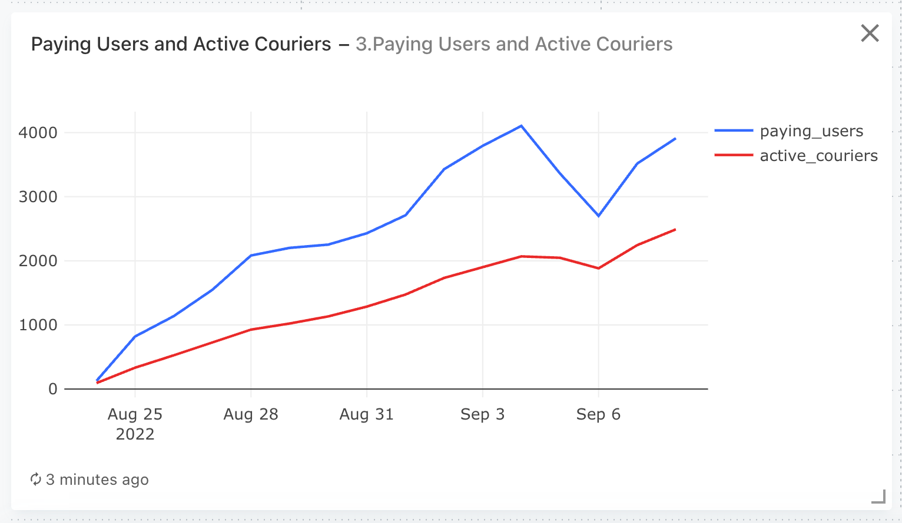
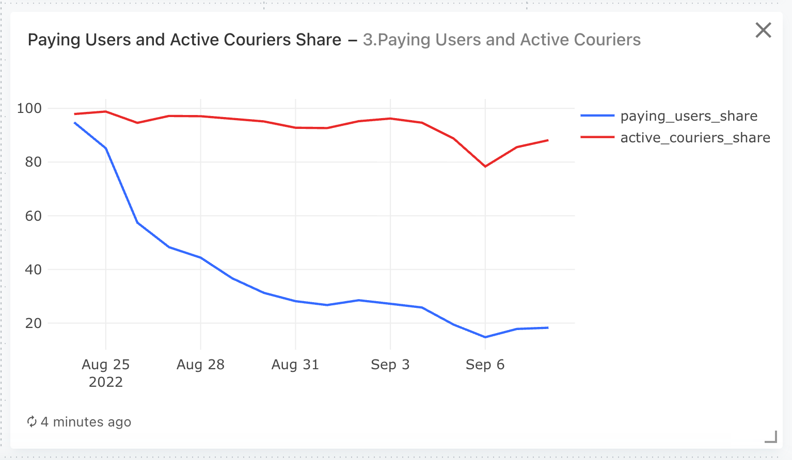
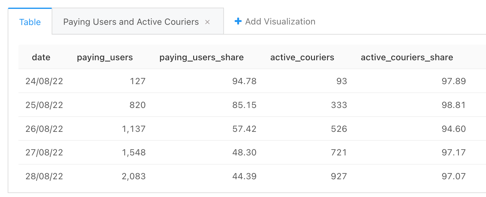

### Задача 3

Для каждого дня, представленного в таблицах user_actions и courier_actions, рассчитайте следующие показатели:

- Число платящих пользователей.
- Число активных курьеров.
- Долю платящих пользователей в общем числе пользователей на текущий день.
- Долю активных курьеров в общем числе курьеров на текущий день.

Платящий пользователь = в данный день оформил хотя бы один заказ, который в дальнейшем не был отменен.

Активный курьер = в данный день принял хотя бы один заказ, который был доставлен или доставил любой заказ.

Общее число пользователей/курьеров на текущий день — это по-прежнему результат сложения числа новых пользователей/курьеров в текущий день со значениями аналогичного показателя всех предыдущих дней. Мы считали этот показатель на предыдущих шагах.

Поля в результирующей таблице: ```date, paying_users, active_couriers, paying_users_share, active_couriers_share```

#### Запрос
```sql
WITH users_first_actions AS (
        SELECT  user_id,
                MIN(time)::date AS date
        FROM user_actions
        GROUP BY user_id
    ),

    couriers_first_actions AS (
        SELECT  courier_id,
                MIN(time)::date AS date
        FROM courier_actions
        GROUP BY courier_id
    ),

    users_and_couriers_first_actions AS (
        SELECT * 
        FROM users_first_actions
        JOIN couriers_first_actions
        USING(date)
    ),

    cancelled_orders AS (
        SELECT order_id
        FROM user_actions
        WHERE action = 'cancel_order'),
        
    users_paid_by_date AS (
        SELECT  time::date as date,
                COUNT(DISTINCT user_id) AS paying_users
        FROM user_actions
        -- платящие - это пользователи, которые создали и не отменили заказы
        WHERE action = 'create_order' AND
                order_id NOT IN (SELECT * FROM cancelled_orders)
        GROUP BY time::date      
    ),
    
    delivered_orders AS (
        SELECT order_id
        FROM courier_actions
        WHERE action = 'deliver_order'
    ),
    
    couriers_active_by_date AS (
        SELECT  time::date AS date,
                COUNT(DISTINCT courier_id) AS active_couriers
        FROM courier_actions
        -- активные - это те курьеры, которые приняли хотя бы один доставленный заказ или доставили
        WHERE (action = 'accept_order' AND
                order_id IN (SELECT * FROM delivered_orders))
                OR (action = 'deliver_order')
        GROUP BY time::date      
    ),
    
    counts_by_date AS (
        SELECT * FROM (
                SELECT date,
                        COUNT(DISTINCT users_and_couriers_first_actions.user_id) AS new_users,
                        COUNT(DISTINCT courier_id) AS new_couriers
                FROM users_and_couriers_first_actions 
                GROUP BY date
                ) AS t1
        JOIN users_paid_by_date
        USING(date) 
        JOIN couriers_active_by_date
        USING(date)    
        ORDER BY date
    ),
    
    metrics AS (
        SELECT  date,
                new_users,
                SUM(new_users) OVER (ORDER BY date)::int AS total_users,
                paying_users,
                new_couriers,
                SUM(new_couriers) OVER (ORDER BY date)::int AS total_couriers,
                active_couriers
        FROM counts_by_date
    )

    
SELECT  date,
        paying_users,
        ROUND (100 * paying_users::decimal / total_users, 2) as paying_users_share,
        active_couriers,
        ROUND (100 * active_couriers::decimal / total_couriers, 2) as active_couriers_share
FROM metrics
```

#### График




#### Выводы


#### Таблица

