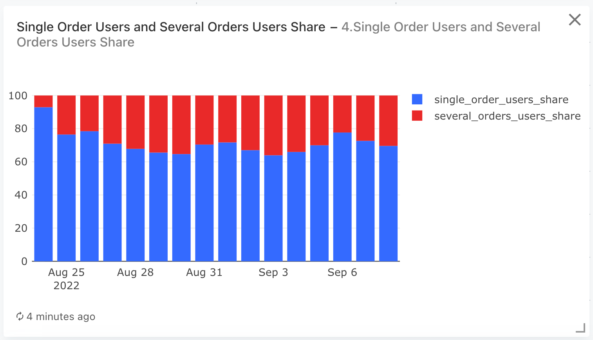
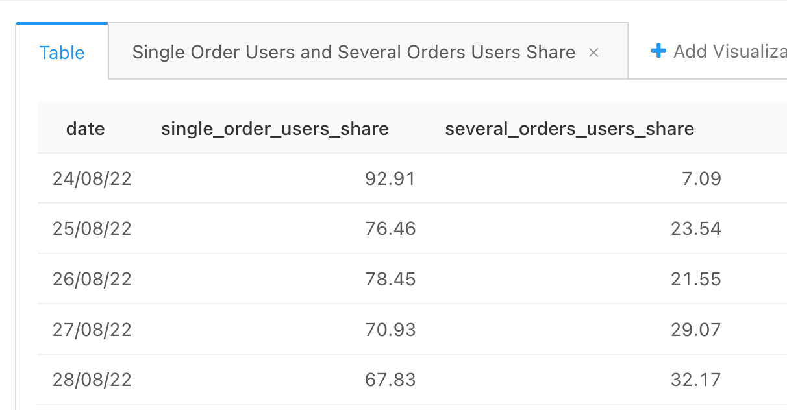

### Задача 4

Для каждого дня, представленного в таблице user_actions, рассчитайте следующие показатели:

- Долю пользователей, сделавших в этот день всего один заказ, в общем количестве платящих пользователей.
- Долю пользователей, сделавших в этот день несколько заказов, в общем количестве платящих пользователей.

Платящими по-прежнему считаем тех пользователей, которые в данный день оформили (и не отменили) хотя бы один заказ.

Поля в результирующей таблице: ```date, single_order_users_share, several_orders_users_share```

#### Запрос
```sql
WITH cancelled_orders AS (
        SELECT order_id
        FROM user_actions
        WHERE action = 'cancel_order'
    ),
        
    -- табличка дата - id польз - 1 заказ    
    users_one_order AS (
        SELECT  time::date as date,
                user_id,
                COUNT(order_id)
        FROM user_actions
        -- платящие - это пользователи, которые создали и не отменили заказы
        WHERE action = 'create_order' AND
                order_id NOT IN (SELECT * FROM cancelled_orders)
        GROUP BY    date,
                    user_id
        HAVING COUNT(user) = 1
    ),

    cnt_users_with_one_order_by_date AS (
        SELECT  date,
                COUNT(user_id) as orders_one_cnt
        FROM users_one_order
        GROUP BY date  
    ),
    
    -- общее число платящих пользователей
    users_paid_by_date AS (
        SELECT  time::date as date,
                COUNT(DISTINCT user_id) as paying_users
        FROM user_actions
        -- платящие - это пользователи, которые создали и не отменили заказы
        WHERE   action = 'create_order' AND
                order_id NOT IN (SELECT * FROM cancelled_orders)
        GROUP BY date    
    )
    
SELECT  date,
        ROUND (100 * orders_one_cnt::decimal / paying_users, 2) as single_order_users_share,
        ROUND (100 * (1 -  orders_one_cnt::decimal / paying_users), 2) as several_orders_users_share
FROM cnt_users_with_one_order_by_date
JOIN users_paid_by_date
USING(date)
ORDER BY date
```

#### График



#### Таблица
