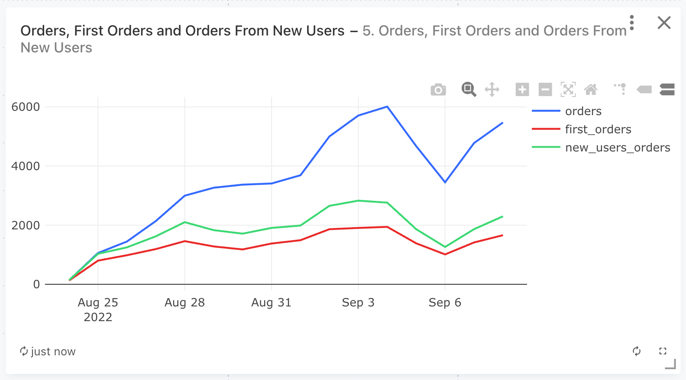
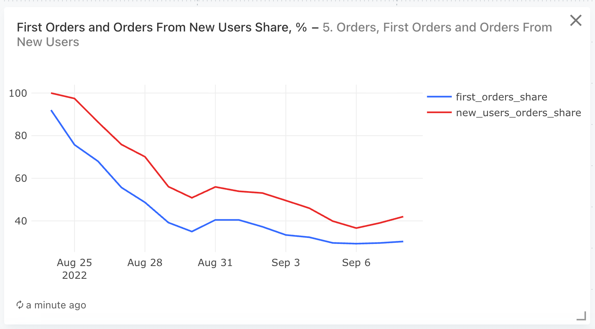

### Задача 5

Для каждого дня, представленного в таблице user_actions, рассчитайте следующие показатели:

- Общее число заказов.
- Число первых заказов (заказов, сделанных пользователями впервые).
- Число заказов новых пользователей (заказов, сделанных пользователями в тот же день, когда они впервые воспользовались сервисом).
- Долю первых заказов в общем числе заказов (долю п.2 в п.1).
- Долю заказов новых пользователей в общем числе заказов (долю п.3 в п.1).

Поля в результирующей таблице: ```date, orders, first_orders, new_users_orders, first_orders_share, new_users_orders_share```


#### Запрос
```sql
WITH created_orders AS (
        SELECT * 
        FROM user_actions
        WHERE action = 'create_order' AND order_id NOT IN (SELECT order_id FROM user_actions
                                                            WHERE action = 'cancel_order')
    ),
    
    -- даты первого ЛЮБОГО действия пользователя
    user_first_action AS (
        SELECT  user_id,
                MIN(time::date) as first_action_date
        --  по всем действиям       
        FROM user_actions      
        GROUP BY user_id
    ),
    
    -- даты первого действия СОЗДАНИЯ ЗАКАЗА пользователя
    user_first_action_created AS (
        SELECT  user_id,
                MIN(time::date) as first_create_date
        --  по созданным и неотмененым заказам      
        FROM created_orders      
        GROUP BY user_id
    ),
    

    new_users_orders AS (
        SELECT  co.user_id as user_id,
                COUNT(DISTINCT order_id) as first_orders_cnt,
                time::date as date
        FROM created_orders as co
        LEFT JOIN user_first_action AS ufa
        ON co.user_id = ufa.user_id
        -- выбираем заказы с датой заказа = дата первого действия
        WHERE co.time::date = ufa.first_action_date
        GROUP BY time, co.user_id
    ),
    
    general_orders_cnt_by_date AS (
        SELECT  time::date as date,
            COUNT(order_id) as orders_cnt
        FROM created_orders
        GROUP BY time::date
        ),
    
    first_orders_cnt_by_date AS (
        SELECT  first_create_date as date,
            COUNT(DISTINCT user_id) as first_orders_cnt
        FROM user_first_action_created
        GROUP BY first_create_date
        ),
        
    new_users_orders_cnt_by_date AS (
        SELECT  date,
                SUM(first_orders_cnt) as new_users_orders_cnt
        FROM new_users_orders
        GROUP BY date
        )    
        
SELECT  date,
        orders_cnt::int AS orders,
        first_orders_cnt::int AS first_orders,
        new_users_orders_cnt::int AS new_users_orders,
        ROUND (100 * first_orders_cnt::decimal / orders_cnt, 2) AS first_orders_share,
        ROUND (100 * new_users_orders_cnt::decimal / orders_cnt, 2) AS new_users_orders_share
FROM new_users_orders_cnt_by_date
JOIN first_orders_cnt_by_date
USING(date)
JOIN general_orders_cnt_by_date
USING(date)   
ORDER BY date
```


#### График




#### Таблица
