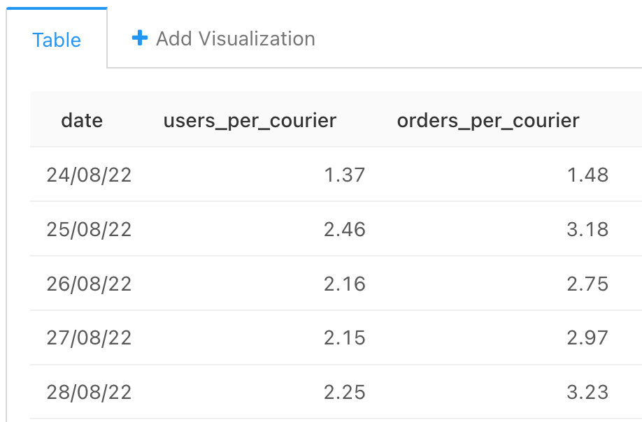

### Задача 6

На основе данных в таблицах user_actions, courier_actions и orders для каждого дня рассчитайте следующие показатели:

- Число платящих пользователей на одного активного курьера.
- Число заказов на одного активного курьера.

Платящий пользователь = в данный день оформил хотя бы один заказ, который в дальнейшем не был отменен.

Активный курьер = в данный день принял хотя бы один заказ, который был доставлен или доставил любой заказ.

Общее число пользователей/курьеров на текущий день — это по-прежнему результат сложения числа новых пользователей/курьеров в текущий день со значениями аналогичного показателя всех предыдущих дней. Мы считали этот показатель на предыдущих шагах.

Поля в результирующей таблице: ```date, users_per_courier, orders_per_courier```


#### Запрос
```sql
WITH users_paid_by_date AS (
        SELECT  time::date as date,
                COUNT(DISTINCT user_id) as paying_users
        FROM user_actions
        -- платящие - это пользователи, которые создали и не отменили заказы
        WHERE action = 'create_order' AND
                order_id NOT IN (   SELECT order_id
                                    FROM user_actions
                                    WHERE action = 'cancel_order')
        GROUP BY time::date      
    ),
    
    couriers_active_by_date AS (
        SELECT  time::date as date,
                COUNT(DISTINCT courier_id) as active_couriers
        FROM courier_actions
        -- активные - это те курьеры, которые приняли хотя бы один доставленный заказ или доставили
        WHERE (action = 'accept_order' AND
                order_id IN (   SELECT order_id
                                FROM courier_actions
                                WHERE action = 'deliver_order'))
                OR (action = 'deliver_order')
        GROUP BY time::date      
    ),
    
    orders_by_date AS (
        SELECT  time::date as date,
                COUNT(order_id) as orders_cnt
        FROM user_actions
        WHERE action = 'create_order' AND
                        order_id NOT IN (   SELECT order_id
                                        FROM user_actions
                                        WHERE action = 'cancel_order')
        GROUP BY time::date
    )
    
SELECT  date,
        ROUND(paying_users::decimal /active_couriers, 2)  as users_per_courier,
        ROUND(orders_cnt:: decimal /active_couriers, 2)   as orders_per_courier
FROM couriers_active_by_date
JOIN users_paid_by_date
USING (date)
JOIN orders_by_date
USING (date)
```

#### График


#### Таблица



    


