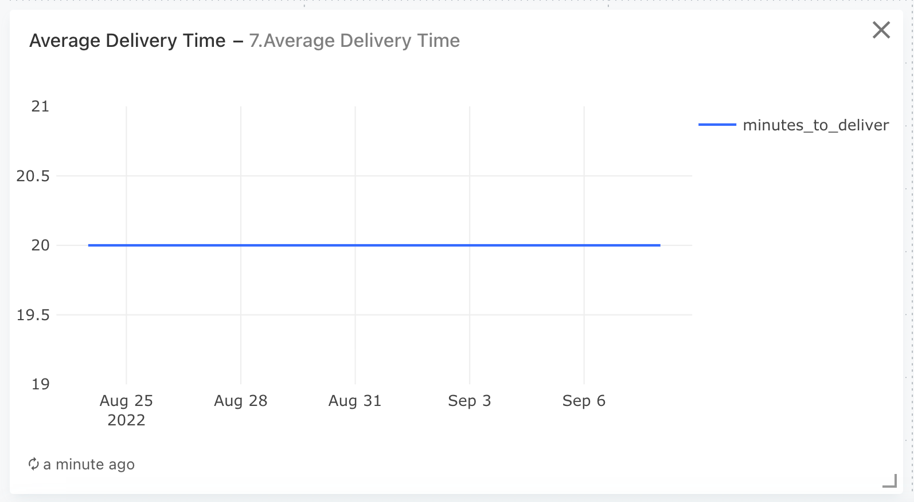
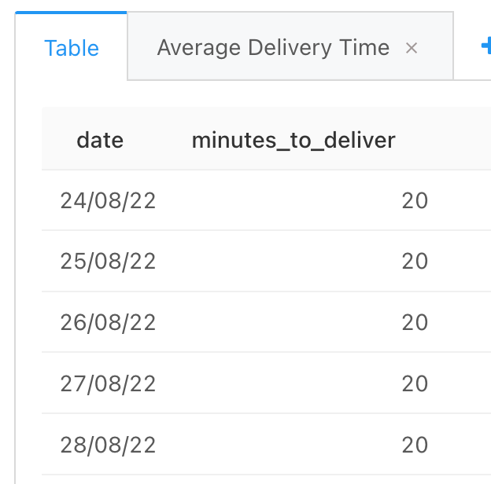

### Задача 7

Давайте рассчитаем ещё один полезный показатель, характеризующий качество работы курьеров.

На основе данных в таблице courier_actions для каждого дня рассчитайте, за сколько минут в среднем курьеры доставляли свои заказы.

Поля в результирующей таблице: ```date, minutes_to_deliver```

Некоторые заказы оформляют в один день, а доставляют уже на следующий. При расчёте среднего времени доставки в качестве дней, для которых считать среднее, используйте дни фактической доставки заказов.

#### Запрос
```sql
WITH orders AS (
    -- нам нужны только заказы у которых есть 2 отметки типа: accept и  delivery
    SELECT  courier_id,
            order_id,
            action, 
            time,
            COUNT(action) OVER (PARTITION BY order_id) as actions_count
    FROM courier_actions        
    ),
    
    -- фильтруем по отметкам
    orders_with_deliver_and_start AS (
        SELECT * 
        FROM orders
        WHERE actions_count = 2
    ),
    
    -- считаем для каждого заказа минуты доставки. для принятых заказов будет 0
    orders_with_minutes AS (
        SELECT time,
                order_id,
                extract(epoch
                        FROM  (LAST_VALUE(time) OVER (PARTITION BY order_id ORDER BY time) - 
                                FIRST_VALUE(time) OVER (PARTITION BY order_id ORDER BY time))
                        )
                        /
                        60 as minutes_to_delivery
                
        FROM orders_with_deliver_and_start
    )
    

SELECT  time::date as date,
        AVG(minutes_to_delivery)::int as minutes_to_deliver
FROM orders_with_minutes
WHERE minutes_to_delivery > 0
GROUP BY (time::date)
ORDER BY date
```


Вариант верного решения
```sql
SELECT date,
       round(avg(delivery_time))::int as minutes_to_deliver
FROM   (SELECT order_id,
               max(time::date) as date,
               extract(epoch
        FROM   max(time) - min(time))/60 as delivery_time
        FROM   courier_actions
        WHERE  order_id not in (SELECT order_id
                                FROM   user_actions
                                WHERE  action = 'cancel_order')
        GROUP BY order_id) t
GROUP BY date
ORDER BY date
```

#### График



#### Таблица


