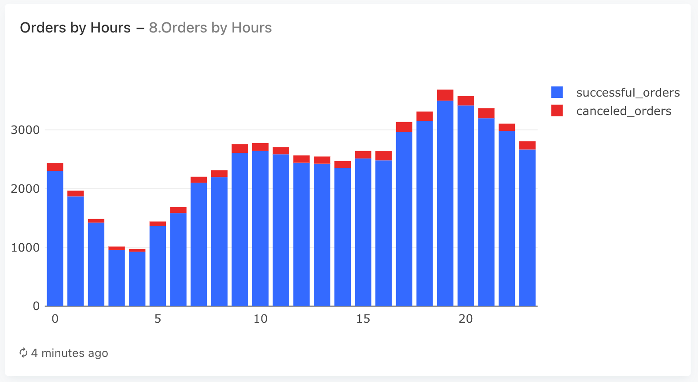
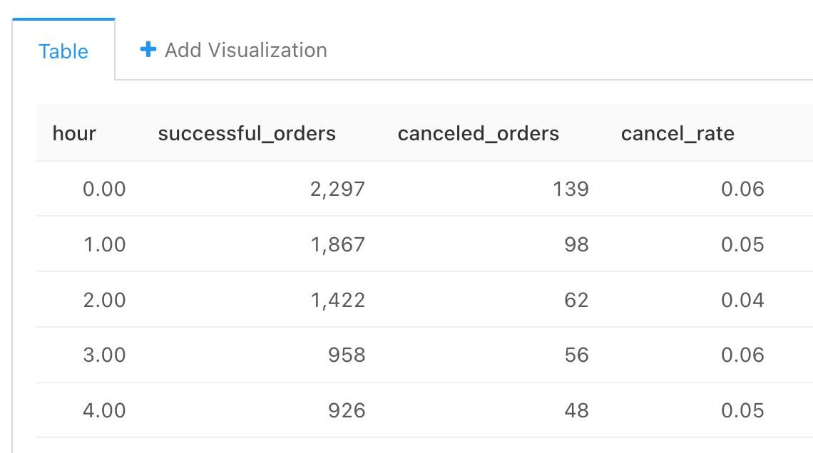

### Задача 8

И наконец, давайте оценим почасовую нагрузку на наш сервис, выясним, в какие часы пользователи оформляют больше всего заказов, 
и заодно проанализируем, как изменяется доля отмен в зависимости от времени оформления заказа.

- Число успешных (доставленных) заказов.
- Число отменённых заказов.
- Долю отменённых заказов в общем числе заказов (cancel rate).

Колонки с показателями назовите соответственно ```successful_orders, canceled_orders, cancel_rate. ```

#### Запрос

```sql
SELECT  hour::int,
        successful_orders,
        canceled_orders,
        ROUND(canceled_orders::decimal / created_orders, 3) as cancel_rate
FROM (
    SELECT  extract(hour from creation_time) as hour,
            COUNT(order_id) FILTER(WHERE ca.action = 'deliver_order') as successful_orders,
            COUNT(order_id) FILTER(WHERE ua.action = 'cancel_order') as canceled_orders,
            COUNT(DISTINCT ua.order_id) as created_orders
    FROM orders
    JOIN user_actions as ua
    USING(order_id)
    JOIN courier_actions as ca
    USING(order_id)
    GROUP BY extract(hour from creation_time) 
) as t
ORDER BY hour
```


#### График



#### Таблица
