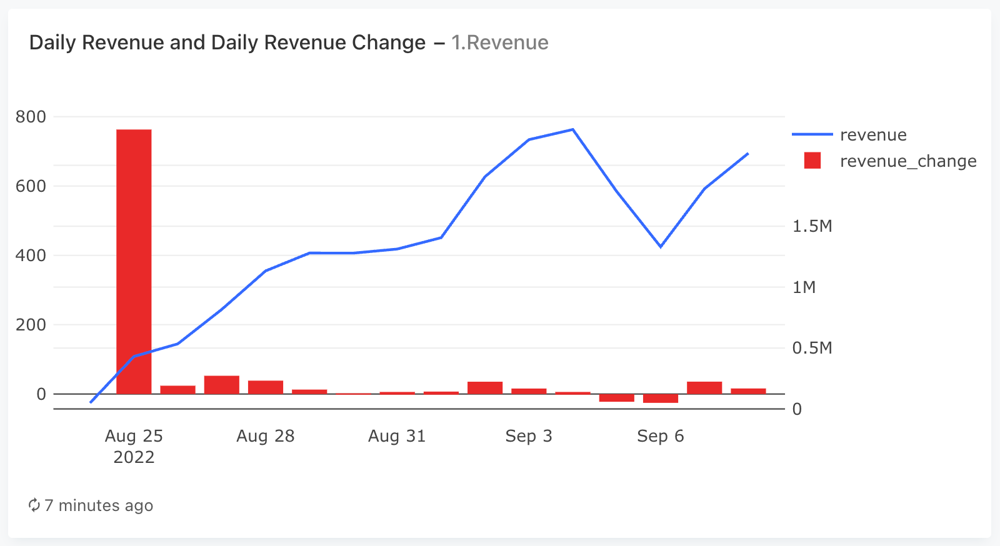
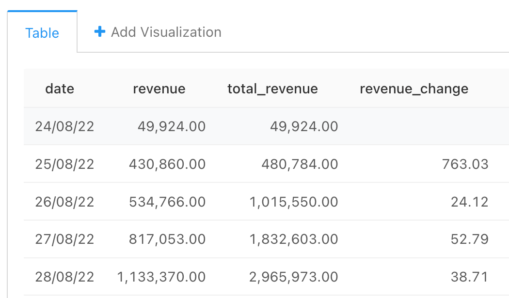

### Задача 1

Начнём с выручки — наиболее общего показателя, который покажет, какой доход приносит наш сервис.

Задание:

Для каждого дня в таблице orders рассчитайте следующие показатели:

- Выручку, полученную в этот день.
- Суммарную выручку на текущий день.
- Прирост выручки, полученной в этот день, относительно значения выручки за предыдущий день.

Поля в результирующей таблице: ```date, revenue, total_revenue, revenue_change```


#### Запрос
```sql
WITH orders_with_prices AS (
    --  сначала раскрыли массив product_ids  с помощью unnest, потом к каждому product_id добавили цену и посчитали итоговую стоимость заказа
    SELECT  order_id,
            SUM(price) as order_price,
            date
    FROM  (SELECT   order_id,
                    unnest(product_ids) as product_id,     
                    creation_time::date as date
            FROM   orders
            -- неотмененные заказы
            WHERE order_id NOT IN (SELECT order_id 
                                    FROM user_actions WHERE action = 'cancel_order')
            ) as o
            LEFT JOIN products as p 
            USING (product_id)
    GROUP BY date, order_id   
    ),
    
    sum_by_date AS (
        SELECT  date,
                SUM(order_price) as revenue
        FROM orders_with_prices   
        GROUP BY date
        ORDER BY date
     )
        
SELECT  date,   
        revenue,
        SUM(revenue) OVER(ORDER BY date) as total_revenue,
        ROUND(100 * (revenue- LAG(revenue, 1) OVER(ORDER BY date))::decimal /  LAG(revenue, 1) OVER(ORDER BY date), 2) 
        as revenue_change
FROM  sum_by_date 
```

#### График



#### Таблица



Вариант верного:

```sql
SELECT date,
       revenue,
       sum(revenue) OVER (ORDER BY date) as total_revenue,
       round(100 * (revenue - lag(revenue, 1) OVER (ORDER BY date))::decimal / lag(revenue, 1) OVER (ORDER BY date),
             2) as revenue_change
FROM   (SELECT creation_time::date as date,
               sum(price) as revenue
        FROM   (SELECT creation_time,
                       unnest(product_ids) as product_id
                FROM   orders
                WHERE  order_id not in (SELECT order_id
                                        FROM   user_actions
                                        WHERE  action = 'cancel_order')) t1
            LEFT JOIN products using (product_id)
        GROUP BY date) t2
```