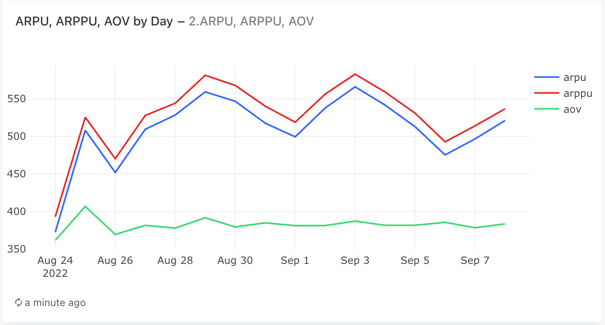
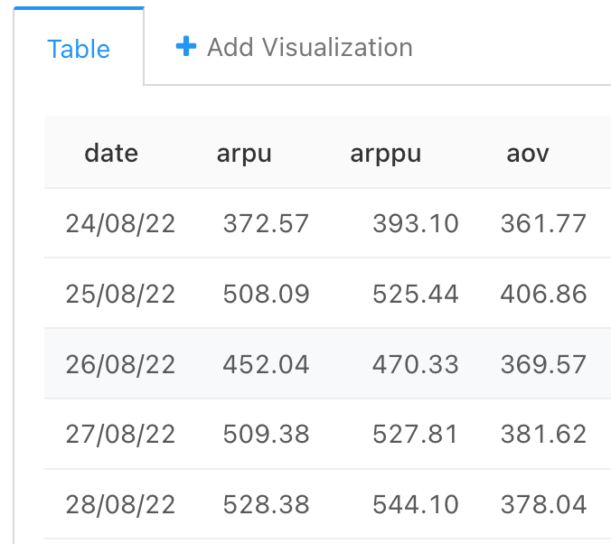

### Задача 2

- ARPU (Average Revenue Per User) — средняя выручка на одного пользователя за определённый период.
- ARPPU (Average Revenue Per Paying User) — средняя выручка на одного платящего пользователя за определённый период.
- AOV (Average Order Value) — средний чек, или отношение выручки за определённый период к общему количеству заказов за это же время.

Если за рассматриваемый период сервис заработал 100 000 рублей и при этом им пользовались 500 уникальных пользователей, из которых 400 сделали в общей сложности 650 заказов, тогда метрики будут иметь следующие значения:

ARPU =100000/500=200

ARPPU =100000/400=250

AOV=100000/650≈153,85

#### Запрос
```sql
WITH orders_with_prices AS (
    --  сначала раскрыли массив product_ids  с помощью unnest, поток к каждому product_id добавили цену и посчитали итоговую стоимость заказа
    SELECT  order_id,
            SUM(price) as order_price,
            date
    FROM  (SELECT   order_id,
                    unnest(product_ids) as product_id,     
                    creation_time::date as date
            FROM   orders
            -- неотмененные заказы
            WHERE order_id NOT IN (SELECT order_id 
                                    FROM user_actions WHERE action = 'cancel_order')
            ) as o
            LEFT JOIN products as p 
            USING (product_id)
    GROUP BY date, order_id   
    ),
    
    revenue_by_date AS (
        SELECT  date,
                SUM(order_price) as revenue
        FROM orders_with_prices   
        GROUP BY date
        ORDER BY date
    ),
    
    -- число заказов в день
    orders_by_date AS (
        SELECT  time:: date as date,
                COUNT(DISTINCT order_id) as orders_cnt
        FROM user_actions
        WHERE order_id NOT IN (SELECT order_id 
                                FROM user_actions WHERE action = 'cancel_order')   -- неотмененных заказов
        GROUP BY time::date           
    ),
    
    -- сколько пользователей было в день
    users_by_date AS (
        SELECT  time:: date as date,
                COUNT(DISTINCT user_id) as users_cnt
        FROM user_actions  -- все заказы
        GROUP BY time::date           
    ),
    
    -- сколько ПЛАТЯЩИХ пользователей было в день
    paying_users_by_date AS (
        SELECT  time:: date as date,
                COUNT(DISTINCT user_id) as paying_users_cnt
        FROM user_actions
        WHERE order_id NOT IN (SELECT order_id 
                                FROM user_actions WHERE action = 'cancel_order')   -- неотмененных заказов
        GROUP BY time::date           
    )
        
SELECT  date,
        ROUND(revenue::decimal / users_cnt, 2) as arpu,
        ROUND(revenue::decimal / paying_users_cnt, 2) as arppu,
        ROUND(revenue::decimal / orders_cnt, 2) as aov
FROM  revenue_by_date
JOIN orders_by_date
USING(date)
JOIN users_by_date
USING(date)
JOIN paying_users_by_date
USING(date)
ORDER BY date
```

#### График



#### Таблица
