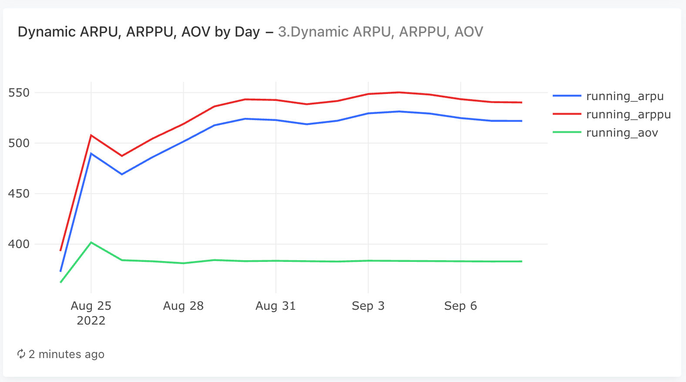
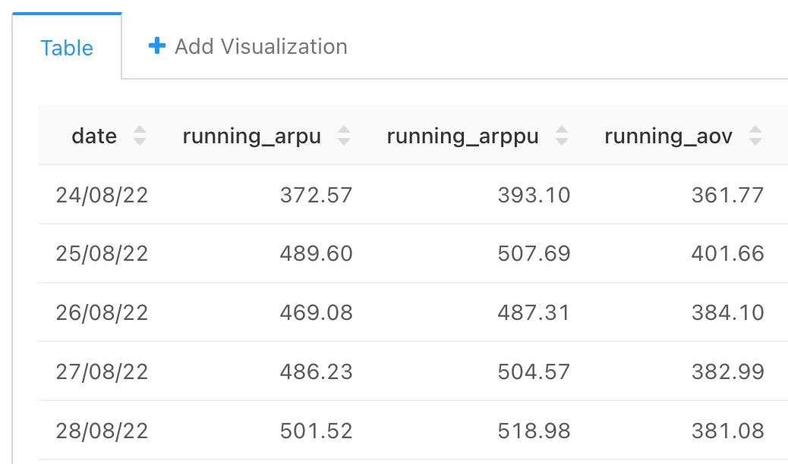

### *Задача 3

Вычислим все те же метрики, но для каждого дня будем учитывать накопленную выручку и все имеющиеся на текущий момент данные о числе пользователей и заказов. Таким образом, получим динамический ARPU, ARPPU и AOV и сможем проследить, как он менялся на протяжении времени с учётом поступающих нам данных.

Задание:

По таблицам orders и user_actions для каждого дня рассчитайте следующие показатели:

- Накопленную выручку на пользователя (Running ARPU).
- Накопленную выручку на платящего пользователя (Running ARPPU).
- Накопленную выручку с заказа, или средний чек (Running AOV).
- Колонки с показателями назовите соответственно running_arpu, running_arppu, running_aov. Колонку с датами назовите date. 

Поля в результирующей таблице: ```date, running_arpu, running_arppu, running_aov```


#### Запрос
```sql
WITH orders_with_prices AS (
    --  сначала раскрыли массив product_ids  с помощью unnest, поток к каждому product_id добавили цену и посчитали итоговую стоимость заказа
    SELECT  order_id,
            SUM(price) as order_price,
            date
    FROM  (SELECT   order_id,
                    unnest(product_ids) as product_id,     
                    creation_time::date as date
            FROM   orders
            -- неотмененные заказы
            WHERE order_id NOT IN (SELECT order_id 
                                    FROM user_actions WHERE action = 'cancel_order')
            ) as o
            LEFT JOIN products as p 
            USING (product_id)
    GROUP BY date, order_id   
    ),
    
    revenue_by_date AS (
        SELECT  date,
                SUM(order_price) as revenue
        FROM orders_with_prices   
        GROUP BY date
        ORDER BY date
    ),
    
    revenue_by_date_running AS (
        SELECT  date,
                SUM(revenue) OVER (ORDER BY date) as revenue_running
        FROM revenue_by_date  
    ),
    
    -- число заказов в день
    orders_by_date AS (
        SELECT  time:: date as date,
                COUNT(DISTINCT order_id) as orders_cnt
        FROM user_actions
        WHERE order_id NOT IN (SELECT order_id 
                                FROM user_actions WHERE action = 'cancel_order')   -- неотмененных заказов
        GROUP BY time::date           
    ),
    
    -- число заказов в день c накопленной суммой
    orders_by_date_running AS (
        SELECT  date,
                SUM(orders_cnt) OVER (ORDER BY date) as orders_cnt_running
        FROM orders_by_date
    ),
    
    -- в качестве пользователей будем смотреть на НОВЫХ пользователей в день
    users_first_actions AS (
    SELECT  user_id,
            MIN(time)::date as first_date
    FROM user_actions
    GROUP BY user_id
    ),
    
    users_first_actions_create AS (
    SELECT  user_id,
            MIN(time)::date as first_date
    FROM user_actions 
    WHERE order_id NOT IN (SELECT order_id 
                                FROM user_actions WHERE action = 'cancel_order')   -- неотмененных заказов
    GROUP BY user_id
    ),
    
    -- сколько НОВЫХ пользователей было в день
    users_by_date AS (
        SELECT  first_date:: date as date,
                COUNT(DISTINCT user_id) as users_cnt
        FROM users_first_actions  -- все заказы
        GROUP BY first_date::date           
    ),
    
    -- сколько НОВЫХ пользователей было в день c накопленной суммой
    users_by_date_running AS (
        SELECT  date,
                SUM(users_cnt) OVER (ORDER BY date) as users_cnt_running
        FROM users_by_date
    ),
    
    -- сколько ПЛАТЯЩИХ НОВЫХ пользователей было в день
    paying_users_by_date AS (
        SELECT  first_date:: date as date,
                COUNT(DISTINCT user_id) as paying_users_cnt
        FROM users_first_actions_create
        GROUP BY first_date::date           
    ),
    
     -- сколько ПЛАТЯЩИХ НОВЫХ пользователей было в день c накопленной суммой
    paying_users_by_date_running AS (
        SELECT  date,
                SUM(paying_users_cnt) OVER (ORDER BY date) as paying_users_cnt_running
        FROM paying_users_by_date
    )
    
        
SELECT  date,
        ROUND(revenue_running::decimal / users_cnt_running, 2) as running_arpu,
        ROUND(revenue_running::decimal / paying_users_cnt_running, 2) as running_arppu,
        ROUND(revenue_running::decimal / orders_cnt_running, 2) as running_aov
FROM  revenue_by_date_running
JOIN orders_by_date_running
USING(date)
JOIN users_by_date_running
USING(date)
JOIN paying_users_by_date_running
USING(date)
ORDER BY date
```


#### График



#### Таблица
