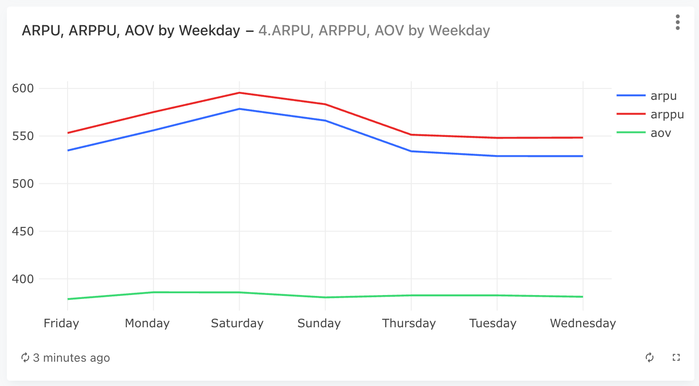
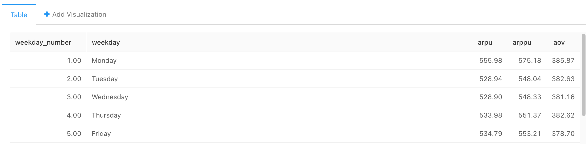

### Задача 4

Для каждого дня недели в таблицах orders и user_actions рассчитайте следующие показатели:

- Выручку на пользователя (ARPU).
- Выручку на платящего пользователя (ARPPU).
- Выручку на заказ (AOV).

При расчётах учитывайте данные только за период с 26 августа 2022 года по 8 сентября 2022 года включительно — так, чтобы в анализ попало одинаковое количество всех дней недели (ровно по два дня).

В результирующую таблицу включите как наименования дней недели (например, Monday), так и порядковый номер дня недели (от 1 до 7, где 1 — это Monday, 7 — это Sunday).

#### Запрос
```sql
WITH orders_with_prices AS (
    --  сначала раскрыли массив product_ids  с помощью unnest, поток к каждому product_id добавили цену и посчитали итоговую стоимость заказа
    SELECT  order_id,
            SUM(price) as order_price,
            date,
            DATE_PART('isodow', date) as dow
    FROM  (SELECT   order_id,
                    unnest(product_ids) as product_id,     
                    creation_time::date as date
            FROM   orders
            -- неотмененные заказы
            WHERE order_id NOT IN (SELECT order_id 
                                    FROM user_actions WHERE action = 'cancel_order')
                  and
                  DATE(creation_time) BETWEEN DATE '2022-08-26' AND DATE '2022-09-08'
            ) as o
            LEFT JOIN products as p 
            USING (product_id)
    GROUP BY date, order_id   
    ),
    
    -- выручка по дням недели
    revenue_by_dow AS (
        SELECT  dow,
                SUM(order_price) as revenue,
                to_char(MIN(date), 'Day') as weekday
        FROM orders_with_prices   
        GROUP BY dow
        ORDER BY dow
    ),
    
     -- сколько пользователей было в день
    users_by_dow AS (
        SELECT  DATE_PART('isodow', time) as dow,
                COUNT(DISTINCT user_id) as users_cnt
        FROM user_actions  -- все заказы
        WHERE DATE(time) BETWEEN DATE '2022-08-26' AND DATE '2022-09-08'
        GROUP BY  DATE_PART('isodow', time)   
    ),
    
    -- сколько ПЛАТЯЩИХ пользователей было в день
    paying_users_by_dow AS (
        SELECT   DATE_PART('isodow', time) as dow,
                COUNT(DISTINCT user_id) as paying_users_cnt
        FROM user_actions
        WHERE order_id NOT IN (SELECT order_id 
                                FROM user_actions WHERE action = 'cancel_order')   -- неотмененных заказов
        AND DATE(time) BETWEEN DATE '2022-08-26' AND DATE '2022-09-08'                        
        GROUP BY  DATE_PART('isodow', time)           
    ),
    
     -- число заказов в день недели
    orders_by_dow AS (
        SELECT  DATE_PART('isodow', time) as dow,
                COUNT(DISTINCT order_id) as orders_cnt
        FROM user_actions
        WHERE order_id NOT IN (SELECT order_id 
                                FROM user_actions WHERE action = 'cancel_order')   -- неотмененных заказов
        AND DATE(time) BETWEEN DATE '2022-08-26' AND DATE '2022-09-08'                        
        GROUP BY DATE_PART('isodow', time)          
    )
    
    
SELECT  dow as weekday_number,
        weekday,
        ROUND(revenue::decimal / users_cnt, 2) as arpu,
        ROUND(revenue::decimal / paying_users_cnt, 2) as arppu,
        ROUND(revenue::decimal / orders_cnt, 2) as aov
        
FROM revenue_by_dow
JOIN paying_users_by_dow
USING(dow)
JOIN users_by_dow
USING(dow)
JOIN orders_by_dow
USING(dow)
ORDER BY dow
```


Вариант верного
```sql
SELECT weekday,
       t1.weekday_number as weekday_number,
       round(revenue::decimal / users, 2) as arpu,
       round(revenue::decimal / paying_users, 2) as arppu,
       round(revenue::decimal / orders, 2) as aov
FROM   (SELECT to_char(creation_time, 'Day') as weekday,
               max(date_part('isodow', creation_time)) as weekday_number,
               count(distinct order_id) as orders,
               sum(price) as revenue
        FROM   (SELECT order_id,
                       creation_time,
                       unnest(product_ids) as product_id
                FROM   orders
                WHERE  order_id not in (SELECT order_id
                                        FROM   user_actions
                                        WHERE  action = 'cancel_order')
                   and creation_time >= '2022-08-26'
                   and creation_time < '2022-09-09') t4
            LEFT JOIN products using(product_id)
        GROUP BY weekday) t1
    LEFT JOIN (SELECT to_char(time, 'Day') as weekday,
                      max(date_part('isodow', time)) as weekday_number,
                      count(distinct user_id) as users
               FROM   user_actions
               WHERE  time >= '2022-08-26'
                  and time < '2022-09-09'
               GROUP BY weekday) t2 using (weekday)
    LEFT JOIN (SELECT to_char(time, 'Day') as weekday,
                      max(date_part('isodow', time)) as weekday_number,
                      count(distinct user_id) as paying_users
               FROM   user_actions
               WHERE  order_id not in (SELECT order_id
                                       FROM   user_actions
                                       WHERE  action = 'cancel_order')
                  and time >= '2022-08-26'
                  and time < '2022-09-09'
               GROUP BY weekday) t3 using (weekday)
ORDER BY weekday_number
```


#### График



#### Таблица

