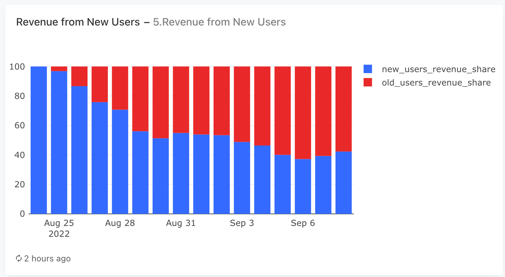
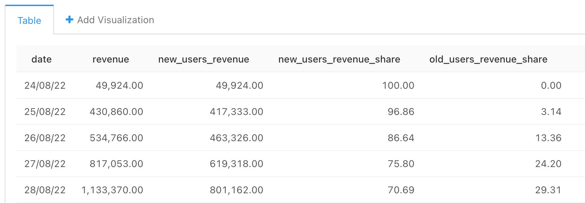

### Задача 5

Немного усложним наш первоначальный запрос и отдельно посчитаем ежедневную выручку с заказов новых пользователей нашего сервиса. Посмотрим, какую долю она составляет в общей выручке с заказов всех пользователей — и новых, и старых.

Задание:

Для каждого дня в таблицах orders и user_actions рассчитайте следующие показатели:

- Выручку, полученную в этот день.
- Выручку с заказов новых пользователей, полученную в этот день.
- Долю выручки с заказов новых пользователей в общей выручке, полученной за этот день.
- Долю выручки с заказов остальных пользователей в общей выручке, полученной за этот день.

Поля в результирующей таблице: ```date, revenue, new_users_revenue, new_users_revenue_share, old_users_revenue_share```

Пояснение: 

Новыми будем считать тех пользователей, которые в данный день совершили своё первое действие в нашем сервисе.

#### Запрос
```sql
WITH
-- первые действия по всем заказам
    users_first_actions_create AS (
        SELECT  user_id,
                MIN(time)::date as first_date
        FROM user_actions 
        GROUP BY user_id
    ),
    
    orders_with_prices AS (
        SELECT  order_id,
                SUM(price) as order_price,
                MIN(creation_time):: date as date
        FROM    (SELECT order_id,
                        unnest(product_ids) as product_id,     
                        creation_time
               FROM   orders
            -- неотмененные заказы
                WHERE order_id NOT IN (SELECT order_id 
                                        FROM user_actions WHERE action = 'cancel_order')
                ) as o
        LEFT JOIN products as p 
        USING (product_id)
        GROUP BY order_id        
    ),
    
    revenue_per_user_per_date AS (
        SELECT user_id,
               date,
               SUM(order_price) as revenue
        FROM orders_with_prices
        JOIN user_actions
        USING(order_id)
        GROUP BY user_id, date
    ),
    
    revenue_per_NEW_user_per_date AS (
        SELECT t1.user_id as user_id,
               revenue,
               date,
               first_date
        FROM revenue_per_user_per_date as t1
        JOIN users_first_actions_create as t2
        ON t1.user_id = t2.user_id
            AND t1.date = t2.first_date
    ),
    
    --  выручка по дням
     revenue_by_date AS (
        SELECT  date,
                SUM(order_price) as revenue
        FROM orders_with_prices   
        GROUP BY date
        ORDER BY date
    ),
    
    revenue_from_new_users_by_date AS (
        SELECT  date,
                SUM(revenue) as new_users_revenue
        FROM revenue_per_NEW_user_per_date  
        GROUP BY date
        ORDER BY date
    )
    

SELECT  date,
        revenue,
        new_users_revenue,
        ROUND(100 * new_users_revenue::decimal / revenue, 2) as new_users_revenue_share,
        ROUND(100 *(1 - new_users_revenue::decimal / revenue), 2) as old_users_revenue_share
FROM revenue_from_new_users_by_date
JOIN revenue_by_date
USING(date)
ORDER BY date
```


Вариант верного
```sql
SELECT date,
       revenue,
       new_users_revenue,
       round(new_users_revenue / revenue * 100, 2) as new_users_revenue_share,
       100 - round(new_users_revenue / revenue * 100, 2) as old_users_revenue_share
FROM   (SELECT creation_time::date as date,
               sum(price) as revenue
        FROM   (SELECT order_id,
                       creation_time,
                       unnest(product_ids) as product_id
                FROM   orders
                WHERE  order_id not in (SELECT order_id
                                        FROM   user_actions
                                        WHERE  action = 'cancel_order')) t3
            LEFT JOIN products using (product_id)
        GROUP BY date) t1
    LEFT JOIN (SELECT start_date as date,
                      sum(revenue) as new_users_revenue
               FROM   (SELECT t5.user_id,
                              t5.start_date,
                              coalesce(t6.revenue, 0) as revenue
                       FROM   (SELECT user_id,
                                      min(time::date) as start_date
                               FROM   user_actions
                               GROUP BY user_id) t5
                           LEFT JOIN (SELECT user_id,
                                             date,
                                             sum(order_price) as revenue
                                      FROM   (SELECT user_id,
                                                     time::date as date,
                                                     order_id
                                              FROM   user_actions
                                              WHERE  order_id not in (SELECT order_id
                                                                      FROM   user_actions
                                                                      WHERE  action = 'cancel_order')) t7
                                          LEFT JOIN (SELECT order_id,
                                                            sum(price) as order_price
                                                     FROM   (SELECT order_id,
                                                                    unnest(product_ids) as product_id
                                                             FROM   orders
                                                             WHERE  order_id not in (SELECT order_id
                                                                                     FROM   user_actions
                                                                                     WHERE  action = 'cancel_order')) t9
                                                         LEFT JOIN products using (product_id)
                                                     GROUP BY order_id) t8 using (order_id)
                                      GROUP BY user_id, date) t6
                               ON t5.user_id = t6.user_id and
                                  t5.start_date = t6.date) t4
               GROUP BY start_date) t2 using (date)
```


#### График



#### Таблица

