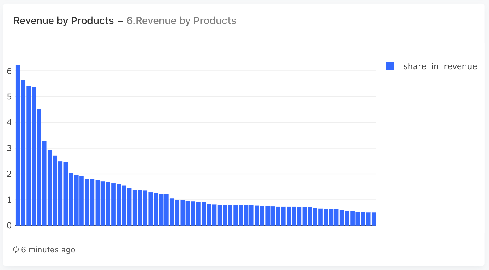
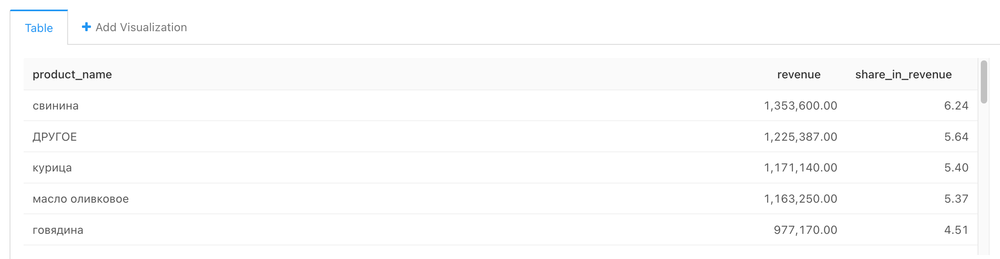

### Задача 6

Для каждого товара, представленного в таблице products:

- Cуммарную выручку, полученную от продажи этого товара за весь период.
- Долю выручки от продажи этого товара в общей выручке, полученной за весь период.

Товары, округлённая доля которых в выручке составляет менее 0.5%, объедините в общую группу с названием «ДРУГОЕ» (без кавычек), просуммировав округлённые доли этих товаров.

#### Запрос
```sql
with revenue_by_product as (SELECT name,
                                   price * cnt as revenue
                            FROM   (SELECT name,
                                           cnt,
                                           product_id,
                                           price
                                    FROM   (SELECT product_id,
                                                   count(product_id) as cnt
                                            FROM   (SELECT unnest(product_ids) as product_id
                                                    FROM   orders
                                                    -- неотмененные заказы
                                                    WHERE  order_id not in (SELECT order_id
                                                                            FROM   user_actions
                                                                            WHERE  action = 'cancel_order')) as t1
                                            GROUP BY product_id) as t2 join products using(product_id)) as t3)
SELECT product_name,
       sum(revenue) as revenue,
       sum(share_in_revenue) as share_in_revenue
FROM   (SELECT case when round(100 * revenue::decimal / (sum(revenue) OVER()),
                               2) < 0.5 then 'ДРУГОЕ'
                    else name end as product_name,
               revenue,
               round(100 * revenue::decimal / (sum(revenue) OVER()), 2) as share_in_revenue
        FROM   revenue_by_product) as t3
GROUP BY product_name
ORDER BY revenue desc
```    

Вариант верного:    
```sql
SELECT product_name,
       sum(revenue) as revenue,
       sum(share_in_revenue) as share_in_revenue
FROM   (SELECT case when round(100 * revenue / sum(revenue) OVER (), 2) >= 0.5 then name
                    else 'ДРУГОЕ' end as product_name,
               revenue,
               round(100 * revenue / sum(revenue) OVER (), 2) as share_in_revenue
        FROM   (SELECT name,
                       sum(price) as revenue
                FROM   (SELECT order_id,
                               unnest(product_ids) as product_id
                        FROM   orders
                        WHERE  order_id not in (SELECT order_id
                                                FROM   user_actions
                                                WHERE  action = 'cancel_order')) t1
                    LEFT JOIN products using(product_id)
                GROUP BY name) t2) t3
GROUP BY product_name
ORDER BY revenue desc
```
    
    
#### График



#### Таблица
